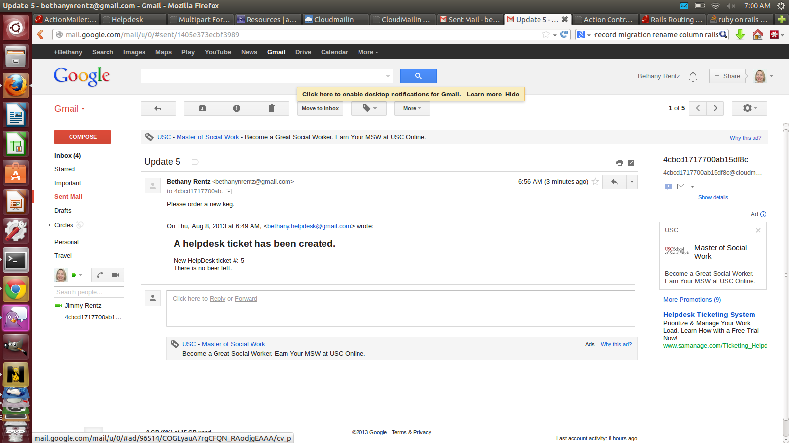

This application demonstrates inbound and outbound email.

Outbound Email
When a ticket is created, an email is sent to a designated email address (currently hard-coded).

The outbound email is using gmail as the SMTP Server.

Inbound Email
A user can send an email to a specific email address to create activities for a specific ticket.

In the subject - use the format "Update ticket_id" and an activity will be created for that ticket based on the contents of the email.

I used cloudmailin as a heroku add-on for inbound emails.

